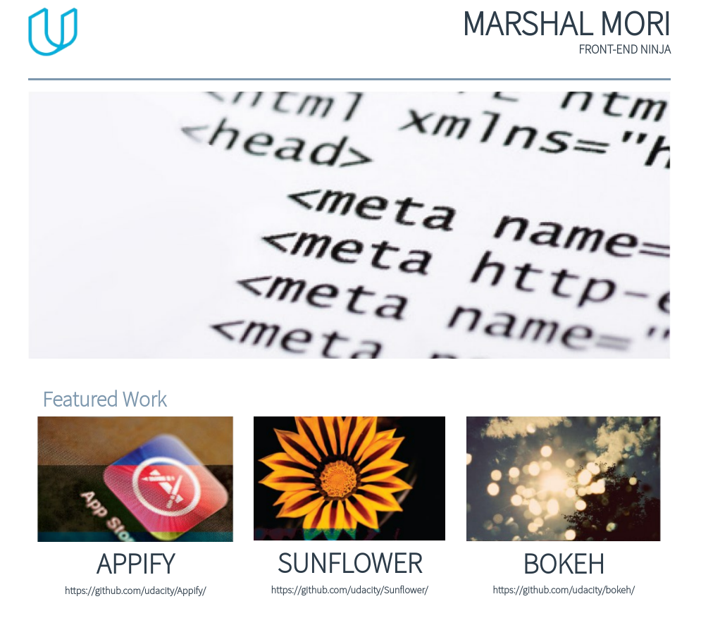
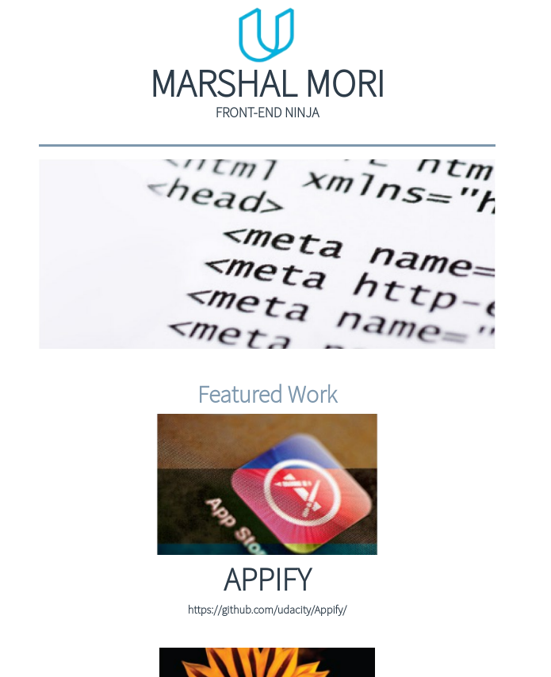
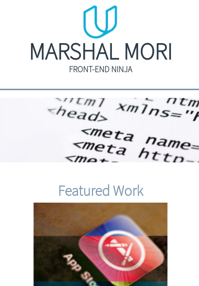

# Portfolio Site
Portfolio Site is an responsive application that shows your works.

## Installation
Here are the steps of the necessary installations:

1. **Download project** - download this project to your machine in a location of your choice.
2. **Open the `index.html` file.**

After the steps above, one page will open in your web browser as shown below:

#### Extra large devices (large desktops, 1200px and up)

#### Large devices (desktops, 992px and up)

####  Medium devices (tablets, 768px and up)

#### Small devices (landscape phones, 576px and up)

## Usage
Click on the work's poster you want and then will open a Github repository.

## License
Portfolio Site is released under the [MIT
license](https://github.com/atom-community/markdown-preview-plus/blob/master/LICENSE.md).
